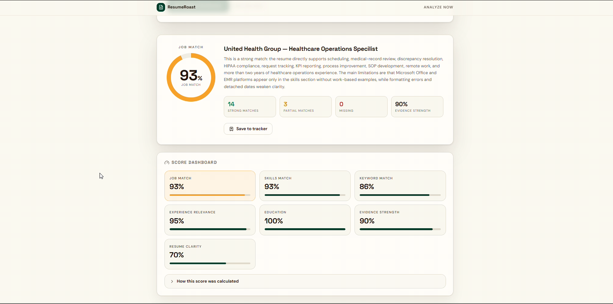
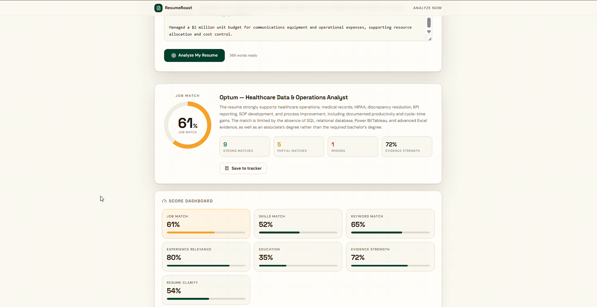
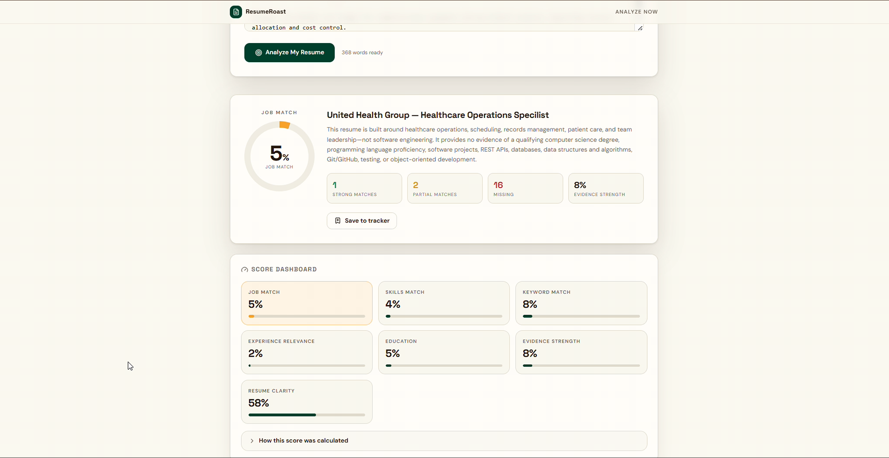

# ResumeRoast

> Get your resume roasted, then fixed.

ResumeRoast is an AI-powered resume analysis and job-matching platform that evaluates how well a resume proves its qualifications for a specific job.

Instead of relying only on keyword matching, ResumeRoast maps job requirements to evidence found in the resume and identifies Strong, Partial, and Missing evidence.

## Features

- AI Resume Analysis
- ATS Analysis
- Job Match Score
- Requirement → Resume Evidence Matching
- Strong / Partial / Missing requirement classification
- Missing Requirements analysis
- Resume bullet improvements
- "Why this is better" explanations
- AI Safety Check
- No-JD Resume Analysis
- Application Tracker

## Job Matching Examples

ResumeRoast compares each job requirement against evidence found in the resume, then classifies it as **Strong**, **Partial**, or **Missing**.

### Strong Match — 93% Job Match



The resume provides strong evidence for most of the role's requirements, with only limited partial matches and no missing requirements in this analysis.

### Partial Match — 61% Job Match



The resume demonstrates relevant experience for several requirements, while other requirements have only partial evidence or no supporting evidence in the resume.

### Mismatch — 5% Job Match



The resume provides little evidence for the target role's requirements, so most requirements are classified as Missing rather than being inferred from unrelated experience.

## Requirement → Evidence Matching

ResumeRoast compares individual job requirements against evidence found in the resume.

Each requirement is classified as:

- 🟢 **Strong** — clear supporting evidence exists
- 🟡 **Partial** — some relevant evidence exists but it is incomplete or indirect
- 🔴 **Missing** — no supporting evidence was found in the provided resume

**Important:** "Missing" means no evidence was found in the resume. It does not automatically mean the candidate does not have the skill.

## Evidence-Based Job Matching

The Job Match score considers factors such as:

- Skills Match
- Experience Relevance
- Education
- Evidence Strength
- Job-specific keywords
- Resume clarity

The goal is to distinguish meaningful evidence from simple keyword overlap.

## AI Safety

ResumeRoast is designed to avoid fabricating candidate qualifications.

The system should never invent:

- Skills
- Programming languages
- Projects
- APIs
- Metrics
- Technical achievements
- Work experience
- Tools or technologies

When evidence is unavailable, the system should explicitly communicate that no evidence was found in the provided resume.

## No-JD Mode

Users can analyze their resume even when they do not have a specific job description.

## Application Tracker

ResumeRoast includes an application tracking workflow for organizing job applications.

## Tech Stack

- React
- TypeScript
- Vite
- Tailwind CSS
- Lovable

## Local Development

```bash
npm install
npm run dev
```
